  

    

  <h3><code>prathik@github ~ $ whoami</code></h3>
  <table>
    <tr>
      <td valign="top" align="center"></td>
      <td valign="top" align="center">
        
      </td>
    </tr>
  </table>

   

  

    

  

    
    &nbsp;
    
  

   

  
  &nbsp;
  
  &nbsp;
  

 

## 🚀 About Me

Computer Science (Data Science) undergraduate at **ACE Engineering College**, Hyderabad. Focused on building practical AI applications, Multimodal RAG platforms, computer vision tools, and core software solutions.

- 🤖 **AI & Multimodal Systems**: Developing RAG architectures with Model Context Protocol (MCP) and conversational video understanding pipelines.
- 👁️ **Computer Vision & Analytics**: Building real-time object detection and instance segmentation inference systems using YOLOv11 and OpenCV.
- 💻 **Computer Science Fundamentals**: Grounded in Data Structures & Algorithms, Object-Oriented Design, and Relational Databases.

---

## 📌 Featured Work

### 1. MCP-Powered RAG Video Intelligence Platform

 

### 2. CognitoEDA – Automated Exploratory Data Analysis

 

### 3. YOLOv11 Vision Inference Pipeline

---

## 📜 Verified Certifications & Achievements

- 🎓 **Oracle Cloud Infrastructure (OCI) 2025 Certified Generative AI Professional** — *Oracle*
- ⚡ **AI Upskilling: Hands-On Development from Model to App** — *Qualcomm*
- 🌐 **ServiceNow Virtual Internship Program** — *AICTE, SmartBridge & ServiceNow University*
- ☁️ **Google Cloud Generative AI Virtual Internship** — *SmartBridge & SmartInternz*
- 🤖 **Artificial Intelligence & Data Analytics Virtual Internship** — *AICTE, Shell & Edunet Foundation*
- 📡 **CCNA: Networking, Security & Automation** — *Cisco Networking Academy*
- 📱 **Android Development & AI/ML Program** — *Google for Developers (EduSkills)*

---

## 🛠️ Technical Skills

- **Languages**: `Java` • `Python` • `SQL` • `R` • `JavaScript` • `HTML/CSS`
- **AI & ML**: `Retrieval-Augmented Generation (RAG)` • `Model Context Protocol (MCP)` • `Computer Vision (OpenCV, YOLOv11)` • `Machine Learning`
- **Frameworks & Libraries**: `Streamlit` • `PyTorch` • `TensorFlow` • `NumPy` • `Pandas` • `Matplotlib` • `Seaborn` • `Scikit-learn`
- **Core CS & Tools**: `Data Structures & Algorithms` • `OOPs` • `DBMS (MySQL, PostgreSQL)` • `Git & GitHub` • `Oracle Cloud (OCI)` • `Linux`

---

## 🎓 Education

- 🏫 **ACE Engineering College** • *B.Tech in Computer Science (Data Science)* • **CGPA: 8.50** *(Aug 2023 – May 2027)*
- 🏫 **Alphores Jr. College** • *MPC Stream* • **GPA: 8.80** *(June 2021 – May 2023)*

---

## 🔍 Currently Exploring

- 🤖 **Retrieval-Augmented Generation (RAG)** & **Model Context Protocol (MCP)** agent tooling.
- 👁️ **Edge Inference & Computer Vision Optimization**.
- 💻 **Advanced Data Structures & Competitive Problem Solving**.

---

  Prathik Salla • 2026

