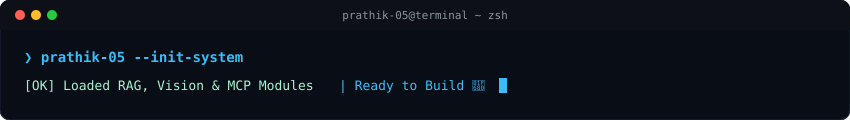
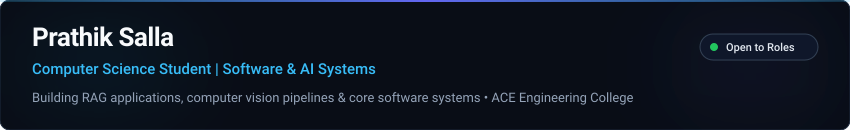

<div align="center">

  <p align="center">
    
  </p>

  <br>

  

  <br><br>

  

  <br><br>

  

  <br><br>

  <a href="https://www.linkedin.com/in/prathik-s07/">
    
  </a>
  &nbsp;
  <a href="mailto:s.prathik1745@gmail.com">
    
  </a>
  &nbsp;
  <a href="https://github.com/prathik-05">
    
  </a>

</div>

<br>

## 🚀 About Me

Computer Science (Data Science) undergraduate at **ACE Engineering College**, Hyderabad. Building practical AI applications, RAG pipelines, computer vision inference tools, and software backend solutions.

- 🛠️ **Engineering Focus**: Full-Stack Development, AI Workflow Automation, RAG Architecture & Computer Vision.
- 🎯 **Problem Solving**: Active in Data Structures & Algorithms, Object-Oriented Design, and System Architecture.
- 🌐 **Open Source**: Actively building and contributing to open-source software tooling and AI platforms.

---

## 💻 Quick Start & Tooling Execution

```bash
# Clone and explore featured AI repositories
git clone https://github.com/prathik-05/MCP-Powered-Video-RAG.git
cd MCP-Powered-Video-RAG
pip install -r requirements.txt
streamlit run app.py
```

---

## 📌 Featured Work

<a href="https://github.com/prathik-05/MCP-Powered-Video-RAG">
  
</a>

<br>

<a href="https://github.com/prathik-05/CognitoEDA">
  
</a>

<br>

<a href="https://github.com/prathik-05/yolov11-object-detection-and-segmentation">
  
</a>

---

## 📜 Verified Certifications & Achievements

- 🎓 **Oracle Cloud Infrastructure (OCI) 2025 Certified Generative AI Professional** — *Oracle*
- ⚡ **AI Upskilling: Hands-On Development from Model to App** — *Qualcomm*
- 🌐 **ServiceNow Virtual Internship Program** — *AICTE, SmartBridge & ServiceNow University*
- ☁️ **Google Cloud Generative AI Virtual Internship** — *SmartBridge & SmartInternz*
- 🤖 **Artificial Intelligence & Data Analytics Virtual Internship** — *AICTE, Shell & Edunet Foundation*
- 📡 **CCNA: Networking, Security & Automation** — *Cisco Networking Academy*
- 📱 **Android Development & AI/ML Program** — *Google for Developers (EduSkills)*

---

## 🛠️ Technical Skills

- **Languages**: `Java` • `Python` • `SQL` • `R` • `HTML/CSS` • `JavaScript`
- **Core CS**: `Data Structures & Algorithms` • `OOPs` • `DBMS` • `Problem Solving`
- **AI & ML**: `Machine Learning` • `RAG` • `Computer Vision` • `AI Workflow Automation`
- **Frameworks & Libraries**: `Streamlit` • `TensorFlow` • `PyTorch` • `OpenCV` • `NumPy` • `Pandas` • `Matplotlib` • `Seaborn` • `Scikit-learn`
- **Cloud & Tools**: `Git` • `GitHub` • `OCI` • `Google Cloud` • `MCP` • `Linux` • `REST APIs`

---

## 🎓 Education

- 🏫 **ACE Engineering College** • *B.Tech in Computer Science (Data Science)* • **CGPA: 8.50** *(Aug 2023 – May 2027)*
- 🏫 **Alphores Jr. College** • *MPC Stream* • **GPA: 8.80** *(June 2021 – May 2023)*

---

## 🔍 Currently Exploring

- 🤖 **Retrieval-Augmented Generation (RAG)** & **Model Context Protocol (MCP)** agent tooling.
- ⚡ **Scalable System Architecture** & High-Throughput Backend Microservices.
- 🌐 **Open Source Development** & AI developer workflows.

---

<div align="center">
  <sub>Prathik Salla • 2026</sub>
</div>
